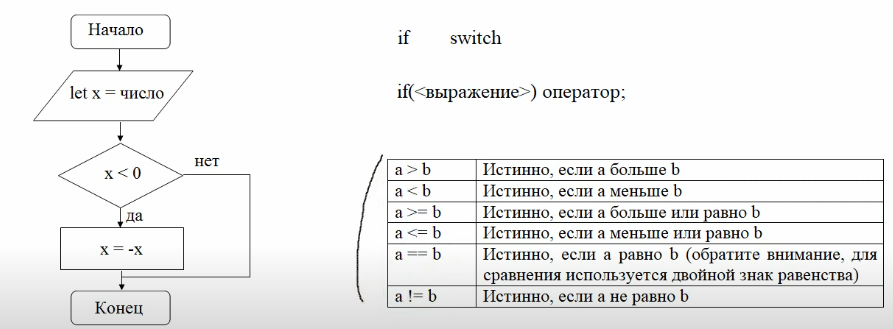
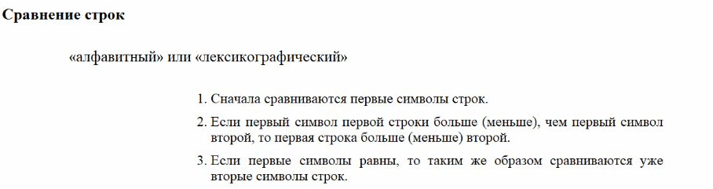
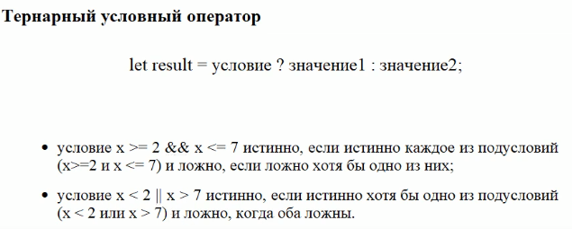

## JavaScript #6
условные операторы if и switch, сравнение строк, строгое сравнение




```javascript
let x = -5;
if(x < 0) x = -x;
console.log("|x| = " + x);   // |x| = 5

console.log(2 > 1);          // true
console.log(2 == 1);         // false
console.log(2 != 1);         // true
let result = 7 > 5;         
console.log(result);         // true
```



```javascript
console.log("Я" > "А");         // true 
console.log("Кот" > "Код");     // true 
console.log("Сонный" > "Сон");  // true
console.log("Сонный" != "Сон");  // true

console.log('2' > 1);           // true, строка становится числом
console.log('01' == 1);         // true, строка тоже станет числом

console.log(true == 1);     // true (true приводится к 1)
console.log(false == 0);    // true (false приводится к 0)
console.log(bull = undefined); // true (оба приводятся к 0)
console.log(bull >= undefined);  // false (null - к нулю, undeined - к NaN) 
console.log(bull <= undefined);  // false (null - к нулю, undeined - к NaN)

console.log(null > 0);      // false
console.log(null == 0);     // false
console.log(null >= 0);     // true (Не понятно по чему) :)
```

## Строгое сравнение === (три равно)
Учитывает сами данные 

```javascript
console.log(true === 1);    // false 
console.log(false === 0);   // false 

console.log('5' === 5);     // false
console.log('7' === 7);     // false
console.log(null === undefined);    // false

console.log('5' !== 5);     // true
console.log(null !== undefined);    // true
```

### if

```javascript
let x = -5;
if(x < 0) console.log("x отрицательное число");
if(x > 0) console.log("x неотрицательное число")
// x отрицательное число

let x = -5;
if(x < 0) console.log("x отрицательное число");
else console.log("x неотрицательное число")
// x отрицательное число

let x = 5;
if(x < 0) console.log("x отрицательное число");
else if (x > 0) console.log("x положительное число");
else console.log("x равно нулю")
// x положительное число

let x = -10, sgn = 0;
if(x < 0) {
    sgn = -1;
    console.log("x отрицательное число", sgn);
}
else if(x > 0) {
    sgn = 1;
    console.log("x положительное число", sgn);
}
else console.log("x равно нулю", sgn);
```



```javascript
let age = 2;
let accessAlloed = age > 18;
console.log(accessAlloed);  // false
```

### Проверка на попадание в диапазон
&& - союз И

```javascript
//x в диапазоне [2: 7]
// x >= 2  x <= 7

let x = 4;
if(x >= 2 && x <= 7) console.log("х попадает в [2: 7]");
else console.log("х не попадает в [2: 7]");
// х не попадает в [2: 7]
```
|| - союз ИЛИ
```javascript
//x не в диапазоне [2: 7]
// x < 2 или x > 7

let x = 4;
if(x > 2 || x < 7) console.log("х попадает в [2: 7]");
else console.log("х не попадает в [2: 7]");
// х попадает в [2: 7]
```
```javascript
//x в диапазоне [2: 7], y не принадлежит [0; 5]

let x = 4; y = -2
if(x >= 2 && x <= 7 && (y < 0 || y > 5)) 
    console.log("х попадает в [2: 7], y не попадает в [0; 5]");
// х попадает в [2: 7], y не попадает в [0; 5]
```
```javascript
let x = 4, y = true, z = false;
if(x) console.log(("х = " + x + " дает true"));
// x = 4 дает true

let x = 4, y = true, z = false;
if(0) console.log(("х = " + x + " дает true"));
// ничего не выведет

let x = 4, y = true, z = false;
if(!0) console.log(("х = " + x + " дает true"));
// x = 4 дает true

let x = 4, y = true, z = false;
if(!0) console.log("0 дает false");
if("0") console.log("строка 0 дает true");
if(!"") console.log("пустая строка дает false");
if(y) console.log("у = true дает true");
if(!z) console.log("z = false дает false");
```


### switch

```javascript
let item = 3;
switch (item) {
    case 1: console.log("item = 1");break;
    case 2: console.log("item = 2");break;
    case 3: console.log("item = 3");break;
    case 4: console.log("item = 4");break;
    default: console.log("item другое значение");
}
```