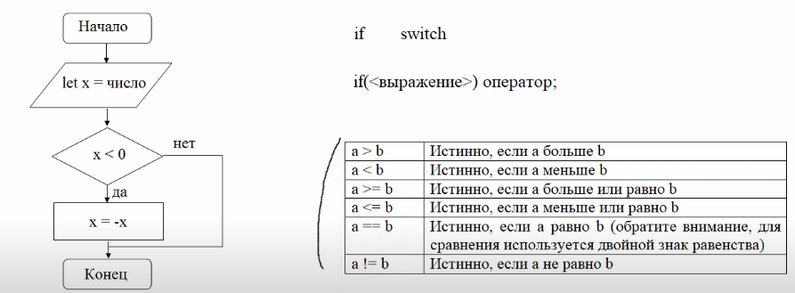
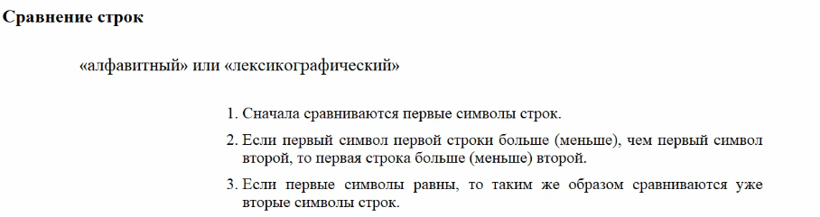
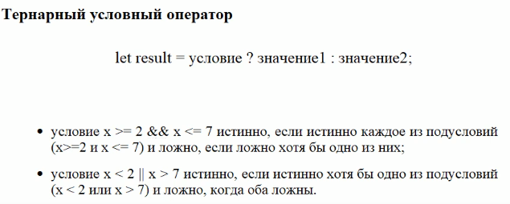
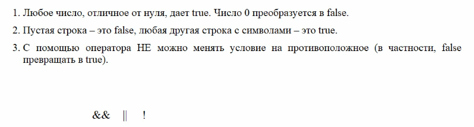

# Конспект по Java Script

## JavaScript #2

### ES6
```javascript
"use strict"; //- нужно чтобы браузер явно переключился на ES6
```


### Комментарии:
```javascript
// - одиночный
/* что-то */ // многострочный
```

### Назначение переменных
```javascript
let  something;             // назначение перемиенной
something = 'some_value'    // можно назначить после обьявления

let user = 'Alex',
age = 25, 
email = 'some@gmail.com'    // несколько за раз

const some_var = 111;       // константа только так. нельзя переназначить после

```

### Вывод в консоль
```javascript
console.log('something'); // ; надо ставить всегда после выражения
```

## JavaScript #3
### Примитивные типы данных
number, string, Infinity, NaN, boolean, null, undefined, Symbol
```javascript
let a = 2;              // number
let b = 2.5;            // number
let c = 'string';       // string
let d = Infinity;       // математическая бесконечность.   
                        // Может быть инвертирована в минус бесконечность
let e = NaN;            // "Не число"
let e = 'string' + 2;   // вернет NaN
let isWin = true, isCheckedField = false; // bool
let someProcess = undefined; // неприсвоено 
let idProcess = null;   // аналог None (присвоено, но ничего не содержит
let id = Symbol('a');   // возвращает уникальный идентификатор с префиксом

let c = `string ${a}`;  // аналог f строки

let cl = "class=\"myclass\""; // \ - экранирование символа
```
### Узнать тип переменной
```javascript
console.log(typeof a) // typeof это как type(a) в питоне
```

## JavaScript #4
приведение типов, оператор присваивания, функции alert, prompt, confirm

### Переобразование типов
```javascript
let a = bool
a = String(a);       // Переобразование в строку
a = Number(a);       // Переобразование в число

let cont = '2' / '6'; // автоматически переведет в числа
// Важное исключение с оператором прибавления. Там надо явно указывать иначе слепит строки в одну

Number("   123   ");    // 123
Number("123z");         // NaN (ошибка чтения числа)
Number(true);           // 1
Number(false);          // 0

Boolean(1);             // true
Boolean(0);             // false
Boolean('0');           // true
Boolean("Hello!");      // true
Boolean('');            // false
```

### Присваивание
```javascript
let a, b, c;
a = b = c = 2 + 2;      // 4 4 4 (справа налево)

let a, b = 1;
let c = 3 - (a -b +1); 
console.log(a, b, c);   // 2 1 1
```

## alert, prompt, confirm

```javascript
alert('Hello');     // выведет в браузере модальное окно

// аналог input()
let age = prompt("how old are you?", 18) ;   // модальное окно со значением по умолчанию


let isCar = confirm('Message'); // модальное окно с выбором. Вернет true или false от выбора
```


## JavaScript #5
арифметические операции: +, -, *, /, **, %, ++, --

### - (минус)
```javascript
let x = 2.8, y = 7.3;
console.log(x-y);       // -4.5

let x = '2.8', y = 7.3;
console.log(x-y);       // -4.5 (с минусом строки превращаются в числа автоматически)

let arg = -x;
console.log(x);         // тоже станет числом

let x = true, y = null, z = undefined;
console.log(-x);    // -1
console.log(-y);    // -0
console.log(-z);    // NaN
console.log(typeof -x, typeof -y, typeof -z); // number number number
```

### + (плюс)

```javascript
let x = 4, y = 7;
let sum = x + y;    // 11

let x = '4', y = 7;
let sum = x + y;    // 47 - строка, бинарный оператор всегда сделает числами

let x = '4', y = 7;
let sum = +x;       // 4 - число. унарный оператор всегда сделает число

let x = '4', y = 'не число', z = true, t = null, u = undefined;
// number number number number
console.log(+x, +y, +z, +t, +u);    // 4 NaN 1 0 Nan

let val = '56';
let dig = +val;     // переобразовалось в число

let x = '4', y = 5; 
console.log(+x + +y);   // 9 число. унарный плюс имеет более высокий приоритет чем бинарный

console.log(3+2+'2');   // 52 потому что выполнение слева на право и сначала сложит числа, а потом переобразует в строку и добавит 2
```

### / (деление) * (умножение)

```javascript
let x = '2', y = 5;
console.log(x/y);       // 0.4
console.log(x*y);       // 10

console.log(x*y+1.3/6-10);  // -2166666... приоритеты как в математике
console.log(x*(y+1.3)/6-10);// -7.9
```

### % (остаток от деления)

```javascript
console.log(5 % 2);     // 1, остаток от деления 5 на 2

console.log(2.5 % 2.3); // примерно 0.6
```

### ** (возведение в степень)

```javascript
console.log(2 ** 2);      // 4 (2 * 2)

console.log(4 ** (1/2));    // 2 (степень 1/2 (квадратный корень))
console.log(8 ** (1/3));    // 2 (степень 1/3 (кубический корень))
```

### ++ (инкремент) и -- (декримент)
++ увеличивает значение переменной на 1  
-- уменьшает значение переменной на 1

```javascript
let counter = 2, cnt = 5;
counter++;  // работает как counter = counter + 1
cnt--;      // работает как cnt = cnt - 1
console.log(counter, cnt);  // 3, 4

// существует 2 вида записи - префиксная и пост префиксная
++a //префиксная
a++ // постпрефиксная
// разница в приоритености при сложении в бинарных операциях.

let a, b;
let c = 10, d = 10;
a = c++;
b = ++d;
console.log(a, b, c, d);        // 10 11 11 11
// у постпрефикса приоритет ниже чем у присваивания. потому сначала 
// добавилась с к переменной а, а лишь потом с увеличилось на 1, а а не поменялось
// в префиксной сначала меняется переменная, а потом присваивается.

let a = 4;
console.log(2 * ++a);   // 10 (4 + 1 = 5, 2 * 5 = 10)
console.log(2 * a++);   // 8  ( 2 * 4 = 8, и только потом поменяется 4+1 = 5)
```

### Операторы присваивания с операцией
```javascript
let a = 0;
let b = 1;
a += 5;                 // эквивалент: a = a + 5
a -= 2;                 // эквивалент: a = a - 2
console.log(a, b)       // 5 -1
a *= 10;                // эквивалент: a = a * 4
b /= 4;                 // эквивалент: b = b / 4
console.log(a, b)       // 50 -0.25
```

## JavaScript #6
условные операторы if и switch, сравнение строк, строгое сравнение




```javascript
let x = -5;
if(x < 0) x = -x;
console.log("|x| = " + x);   // |x| = 5

console.log(2 > 1);          // true
console.log(2 == 1);         // false
console.log(2 != 1);         // true
let result = 7 > 5;         
console.log(result);         // true
```



```javascript
console.log("Я" > "А");         // true 
console.log("Кот" > "Код");     // true 
console.log("Сонный" > "Сон");  // true
console.log("Сонный" != "Сон");  // true

console.log('2' > 1);           // true, строка становится числом
console.log('01' == 1);         // true, строка тоже станет числом

console.log(true == 1);     // true (true приводится к 1)
console.log(false == 0);    // true (false приводится к 0)
console.log(bull = undefined); // true (оба приводятся к 0)
console.log(bull >= undefined);  // false (null - к нулю, undeined - к NaN) 
console.log(bull <= undefined);  // false (null - к нулю, undeined - к NaN)

console.log(null > 0);      // false
console.log(null == 0);     // false
console.log(null >= 0);     // true (Не понятно по чему) :)
```

## Строгое сравнение === (три равно)
Учитывает сами данные 

```javascript
console.log(true === 1);    // false 
console.log(false === 0);   // false 

console.log('5' === 5);     // false
console.log('7' === 7);     // false
console.log(null === undefined);    // false

console.log('5' !== 5);     // true
console.log(null !== undefined);    // true
```

### if

```javascript
let x = -5;
if(x < 0) console.log("x отрицательное число");
if(x > 0) console.log("x неотрицательное число")
// x отрицательное число

let x = -5;
if(x < 0) console.log("x отрицательное число");
else console.log("x неотрицательное число")
// x отрицательное число

let x = 5;
if(x < 0) console.log("x отрицательное число");
else if (x > 0) console.log("x положительное число");
else console.log("x равно нулю")
// x положительное число

let x = -10, sgn = 0;
if(x < 0) {
    sgn = -1;
    console.log("x отрицательное число", sgn);
}
else if(x > 0) {
    sgn = 1;
    console.log("x положительное число", sgn);
}
else console.log("x равно нулю", sgn);
```



```javascript
let age = 2;
let accessAlloed = age > 18;
console.log(accessAlloed);  // false
```

### Проверка на попадание в диапазон
&& - союз И

```javascript
//x в диапазоне [2: 7]
// x >= 2  x <= 7

let x = 4;
if(x >= 2 && x <= 7) console.log("х попадает в [2: 7]");
else console.log("х не попадает в [2: 7]");
// х не попадает в [2: 7]
```
|| - союз ИЛИ
```javascript
//x не в диапазоне [2: 7]
// x < 2 или x > 7

let x = 4;
if(x > 2 || x < 7) console.log("х попадает в [2: 7]");
else console.log("х не попадает в [2: 7]");
// х попадает в [2: 7]
```
```javascript
//x в диапазоне [2: 7], y не принадлежит [0; 5]

let x = 4; y = -2
if(x >= 2 && x <= 7 && (y < 0 || y > 5)) 
    console.log("х попадает в [2: 7], y не попадает в [0; 5]");
// х попадает в [2: 7], y не попадает в [0; 5]
```
```javascript
let x = 4, y = true, z = false;
if(x) console.log(("х = " + x + " дает true"));
// x = 4 дает true

let x = 4, y = true, z = false;
if(0) console.log(("х = " + x + " дает true"));
// ничего не выведет

let x = 4, y = true, z = false;
if(!0) console.log(("х = " + x + " дает true"));
// x = 4 дает true

let x = 4, y = true, z = false;
if(!0) console.log("0 дает false");
if("0") console.log("строка 0 дает true");
if(!"") console.log("пустая строка дает false");
if(y) console.log("у = true дает true");
if(!z) console.log("z = false дает false");
```


### switch

```javascript
let item = 3;
switch (item) {
    case 1: console.log("item = 1");break;
    case 2: console.log("item = 2");break;
    case 3: console.log("item = 3");break;
    case 4: console.log("item = 4");break;
    default: console.log("item другое значение");
}
```